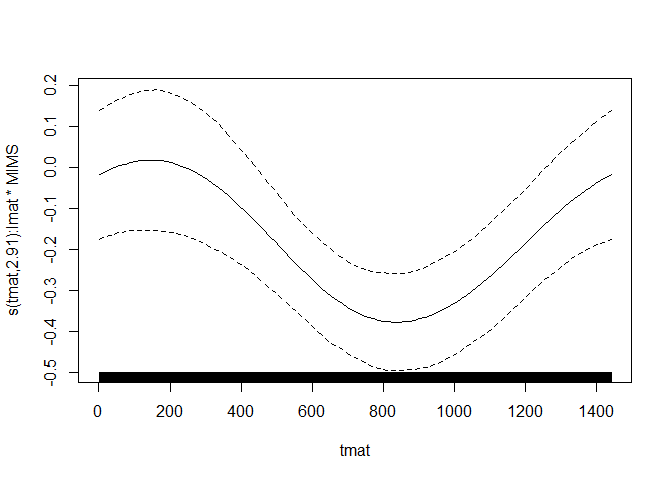
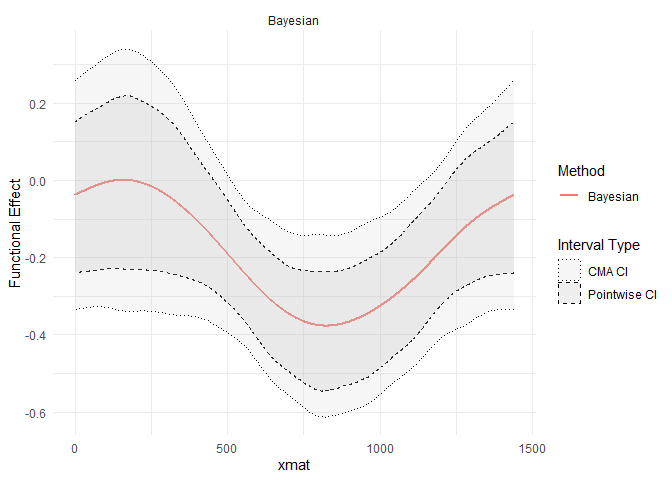

# refundBayes: Bayesian Functional Regression using Stan

## 2025-02-03

This vignette introduces the use of the `refundBayes` package with the NHANES dataset. The `refundBayes` package provides users with a convenient way to perform Bayesian functional data analysis using Stan, a state-of-the-art Bayesian analysis language. The syntax of `refundBayes` is designed to resemble that of `mgcv::gam`, but it employs Bayesian posterior inference and includes additional arguments specific to the Stan implementation.

### Key Features Demonstrated in this Vignette:

-   Fitting a Bayesian functional regression model with scalar (binary and Gaussian) outcomes using Stan.
-   Plotting pointwise and correlation and multiplicity-adjusted (CMA) credible intervals for the estimated functional coefficients.
-   Performing Bayesian model diagnostics using trace plots.

We also compare the Bayesian model output to that of the frequentist package `mgcv` in terms of the functional coefficient estimation.

------------------------------------------------------------------------

## Preparation

### Install the `refundBayes` Package

The `refundBayes` package can be installed from the source file available in this repository. If the required packages are not already installed, they need to be installed manually before installing `refundBayes`

``` r
# Install required dependencies if not already installed
install.packages(c("refund","splines2","scam","rstan"))

# Install refundBayes from the source file
install.packages("refundBayes_0.3.tar.gz", type = "source", repos = NULL)
```

### Prepare the NHANES Dataset

NHANES (National Health and Nutrition Examination Survey) is a nationwide study conducted by the CDC to assess the health and nutritional status of U.S. residents. It is conducted in two-year waves with approximately 10,000 participants per wave.

For this example, we analyze the association between scalar and functional predictors and mortality in NHANES. The functional predictor is the minute-level average daily physical activity measured using accelerometers. Data was summarized in "Monitor Independent Movement Summary" (MIMS) units and log-transformed to achieve a more symmetric distribution. After processing, each participant has a 1,440-dimensional vector of average log-MIMS values.

Mortality data was obtained by linking NHANES data to death certificate records from the National Death Index, maintained by the National Center for Health Statistics (NCHS), through 2019. The preprocessed dataset can be downloaded from:

[Download NHANES Dataset](http://www.ciprianstats.org/sites/default/files/nhanes/nhanes_fda_with_r.rds)

The study outcome is a binary indicator of five-year mortality, with predictors including:

-   Functional predictor: minute-level physical activity (average log-MIMS)

-   Scalar predictors: age, gender, race, body mass index (BMI), poverty-to-income ratio (PIR), coronary heart disease (CHD), and education level.

We fit the following scalar-on-function regression (SoFR) model:

$$
logit(p_i) = \eta_0 + \int_{0}^1 W_i(t)\beta(t)dt + \mathbf{Z}_i^T\mathbf{\gamma}
$$

where:

-   $p_i$ is the probability of five-year mortality for participant $i$,

-   $\eta_0$ is the intercept,

-   $W_i(t)$ represents the functional predictor (physical activity),

-   $\beta(t)$ is the functional coefficient of interest,

-   $\mathbf{Z}_i$ is the vector of scalar predictors with corresponding coefficients $\gamma$.

After loading the data, we subset participants with fully observed covariates:

``` r
set.seed(12345)
# Load the preprocessed data
nhanes_fda_with_r = readRDS("nhanes_fda_with_r.rds")

# Retain only participants with fully observed covariates
covariates = c("age", "gender", "race", "BMI", "PIR", "CHD", "education")
nhanes_lite_use = nhanes_fda_with_r
for (cova in covariates) {
  nhanes_lite_use = nhanes_lite_use[!is.na(nhanes_lite_use[[cova]]), ]
}
nhanes_lite_use = nhanes_lite_use[!is.na(nhanes_lite_use$event), ]
nhanes_lite_use = nhanes_lite_use[nhanes_lite_use$CHD != "Refused", ]

# Create auxiliary matrices for functional regression
nhanes_lite_use$lmat = matrix(1/1440, ncol = 1440, nrow = nrow(nhanes_lite_use))
nhanes_lite_use$tmat = matrix(1:1440, ncol = 1440, nrow = nrow(nhanes_lite_use), byrow = TRUE)

# Define the outcome variable for five-year mortality
nhanes_lite_use$five_year_mort = (nhanes_lite_use$time < 60) & (nhanes_lite_use$event == 1)
```

------------------------------------------------------------------------

## Frequentist Approach

### Fit the Frequentist Model with the mgcv Package

We first fit the scalar-on-function regression (SoFR) model using the frequentist `mgcv` package.

``` r
library(mgcv)
fit_freq_b = gam(five_year_mort ~ age + gender + race + BMI + PIR + CHD + education + 
                 s(tmat,  by = lmat * MIMS, bs = "cc", k = 10),
                 data = nhanes_lite_use, 
                 family = binomial())
```

Here, we briefly explain the syntax of the `gam` function for the scalar-on-function regression. In the `gam` function, the first quantity specified in the model syntax is the response variable (in our example, the indicator of five-year mortality), followed by the syntax which specifies the linear predictor, separated by a tilde ($\sim$). The `s` function specifies the integral part of the linear predictor $\int_{0}^1 W_i(t)\beta(t)dt$. Because the functional covariate is periodic (i.e., midnight is represented as both 0 and 24), we model the functional effect $\beta(t)$ as periodic using a cyclic cubic penalized regression spline. Specifically, the argument s(tmat, by=lmat\*MIMS, bs="cc", k=10) creates a cyclic cubic regression spline (indicated by bs="cc") with 10 degrees of freedom (specified by k=10).

### Frequentist Inference on the Functional Coefficient

#### Visualization for the Functional Coefficients

The `plot.gam` function provides a visual representation of the estimated functional coefficient along with pointwise confidence intervals, which are useful for understanding the variability of the estimated effect at each time point. The pointwise confidence interval can be directly obtained through `plot.gam`. However, to obtain the correlation and multiplicity adjusted (CMA) confidence interval, we need to manually calculate using the joint distribution of the estimated parameters, see [Crainiceanu, Goldsmith, Leroux, and Cui 2024](https://functionaldataanalysis.org/) for more detail. 

``` r
# Compute the pointwise confidence interval for the functional coefficient  
plotfot.condi = plot.gam(fit_freq_b, unconditional = FALSE, rug = FALSE)
```

<!-- -->

#### Summary Table for the Scalar Coefficients

The `summary` function can be used to create a summary table for the scalar coefficients:

``` r
# Summary of the scalar coefficients
summary(fit_freq_b)
```

```         
## 
## Family: binomial 
## Link function: logit 
## 
## Formula:
## five_year_mort ~ age + gender + race + BMI + PIR + CHD + education + 
##     s(tmat, by = lmat * MIMS, bs = "cc", k = 10)
## 
## Parametric coefficients:
##                                  Estimate Std. Error z value Pr(>|z|)    
## (Intercept)                     -3.732099   0.551701  -6.765 1.34e-11 ***
## age                              0.063007   0.004641  13.577  < 2e-16 ***
## genderFemale                    -0.066124   0.108344  -0.610 0.541652    
## raceOther Hispanic               0.104646   0.298531   0.351 0.725935    
## raceNon-Hispanic White           0.626290   0.236013   2.654 0.007963 ** 
## raceNon-Hispanic Black           0.432116   0.245750   1.758 0.078687 .  
## raceNon-Hispanic Asian          -0.256276   0.337382  -0.760 0.447493    
## raceOther Race                   0.738465   0.395814   1.866 0.062085 .  
## BMI                             -0.022817   0.008126  -2.808 0.004990 ** 
## PIR                             -0.163260   0.039069  -4.179 2.93e-05 ***
## CHDYes                           0.568677   0.155830   3.649 0.000263 ***
## CHDDon't know                    1.323754   0.483516   2.738 0.006186 ** 
## educationHigh school equivalent -0.143314   0.143111  -1.001 0.316625    
## educationMore than high school  -0.368270   0.138175  -2.665 0.007694 ** 
## educationDon't know              1.811336   1.277304   1.418 0.156164    
## ---
## Signif. codes:  0 '***' 0.001 '**' 0.01 '*' 0.05 '.' 0.1 ' ' 1
## 
## Approximate significance of smooth terms:
##                       edf Ref.df Chi.sq p-value    
## s(tmat):lmat * MIMS 2.908  3.398  108.5  <2e-16 ***
## ---
## Signif. codes:  0 '***' 0.001 '**' 0.01 '*' 0.05 '.' 0.1 ' ' 1
## 
## R-sq.(adj) =  0.197   Deviance explained = 26.8%
## UBRE = -0.64958  Scale est. = 1         n = 7605
```

------------------------------------------------------------------------

## Bayesian Approach

### Fit the Bayesian Model Using the refundBayes package

We now fit the Bayesian functional regression model using our `refundBayes` package. The `bfrs` function from `refundBayes` package uses a similar argument as the `gam` function. The function automatically generates the code and pre-processes the input data for the Bayesian functional regression using Stan.

``` r
library(refundBayes)
```

``` r
# The bfrs function takes a similar formula syntax to that in the gam function.
fit_sofr <- sofr_bayes(five_year_mort ~ age + gender + race + BMI + PIR + CHD + education +
     s(tmat, by = lmat * MIMS, bs = "cc", k = 10),
     data     = nhanes_lite_use,
     family   = binomial(),
     runStan  = TRUE,
     niter   = 1500,
     nwarmup = 500
)
```

The `bfrs` function use the exact same syntax as the `gam` function for the functional regression model, data, and outcome type (family). Besides, it uses some additional arguments for the Stan:

-   `runStan`: This argument specifies whether the function automatically run the Stan program after generating the Stan code and data. If `runStan = FALSE`, the function will only provides the code and pre-processed data for use in Stan.

-   `n.iter`: The number of total posterior samples per chain.

-   `n.warmup`: Number of samples discarded at the beginning of the sampling (burn-in value).

-   `n.knots`: Number of parallel computed chains for posterior sampling. `bfrs` uses the same number of CPU cores as the number of chains. We recommend setting this value greater than 1 to assess the convergence of the MCMC sampling. Notice that this is different from the "knots" terminology used in spline basis.

### Posterior Inference and Uncertainty Quantification

Bayesian inference provides not only point estimates but also full posterior distributions for the functional and scalar coefficients. This allows us to construct credible intervals that appropriately capture uncertainty in parameter estimates. Users can extract the full posterior samples for the functional coefficients $\beta(t)$ through `fit_bfrs$func_effect`, and the posterior samples for the scalar coefficients $\mathbf{\gamma}$ through `fit_bfrs$stanfit`.

`refundBayes` package also provides a set of functions for summarizing the posterior estimates.

#### Visualization for the Functional Coefficients

To visualize the functional coefficient estimates along with their uncertainty, we can generate the pointwise and CMA credible intervals through the `plot.bfrs` function:

``` r
library(ggplot2)
# Plot the credible intervals
plot(fit_sofr,include = "both")
```

<!-- -->

#### Summary Table for the Scalar Coefficients

For scalar coefficients, we summarize their posterior distributions through the `summary_scalar.bfrs` function:

``` r
# Summary of the scalar coefficients
summary(fit_sofr)[[1]]
```

```         
##                  Scalar Predictor        mean 0.025 quantile 0.975 quantile
## 1                              age  0.06337393     0.05458013    0.072040792
## 2                     genderFemale -0.06199886    -0.27936916    0.157995608
## 3               raceOther Hispanic  0.10092165    -0.48599420    0.692193724
## 4           raceNon-Hispanic White  0.63742628     0.20515976    1.120063227
## 5           raceNon-Hispanic Black  0.44020062    -0.03838770    0.940556823
## 6           raceNon-Hispanic Asian -0.28069220    -0.96618002    0.337431446
## 7                   raceOther Race  0.71941280    -0.05751275    1.478630197
## 8                              BMI -0.02331439    -0.03950182   -0.007373535
## 9                              PIR -0.16500340    -0.24031536   -0.088812636
## 10                          CHDYes  0.57221536     0.28285920    0.871791445
## 11                   CHDDon't know  1.34511955     0.34465840    2.309125591
## 12 educationHigh school equivalent -0.14543798    -0.42143180    0.126768684
## 13  educationMore than high school -0.36408213    -0.64386679   -0.102800062
## 14             educationDon't know  2.18903895    -0.35621317    5.549752727
```
