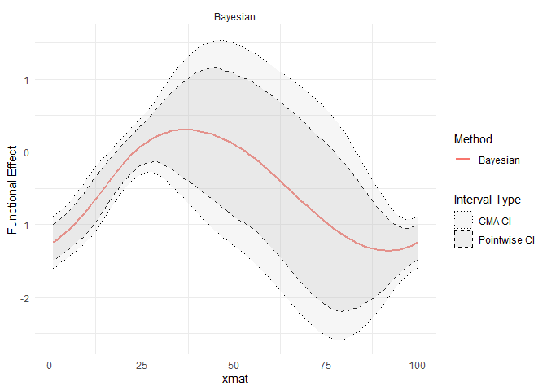
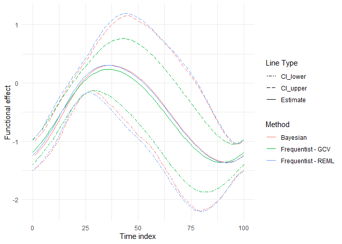
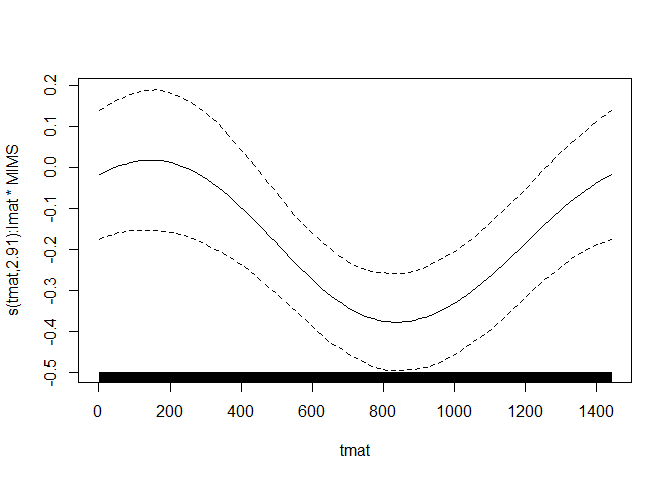
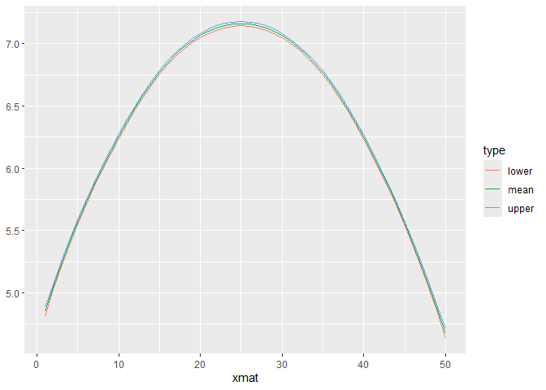

# refundBayes: Bayesian Functional Regression using Stan

## 2026-03-02

This vignette introduces the use of the `refundBayes` package with simple examples for: (1) Bayesian Scalar-on-Function Regression (SoFR), (2) Bayesian Functional Cox Rergession (FCox), and (3) Bayesian Function-on-Scalar Rergession (FoSR). The `refundBayes` package provides users with a convenient way to perform Bayesian functional data analysis using Stan, a state-of-the-art Bayesian analysis language. The syntax of `refundBayes` is designed to resemble that of `mgcv::gam`, but it employs Bayesian posterior inference and includes additional arguments specific to the Stan implementation.

# Install the refundBayes package from Github

``` r
library(remotes)
remotes::install_github("https://github.com/ZirenJiang/refundBayes")
```

```         
## Skipping install of 'refundBayes' from a github remote, the SHA1 (5a1f14ca) has not changed since last install.
##   Use `force = TRUE` to force installation
```

# Bayesian Scalar-on-Function Regression (SoFR)

``` r
##  Read the example data
data.SoFR = readRDS("data/example_data_sofr.rds")

##  Run Bayesian SOFR with the sofr_bayes() function
refundBayes_SoFR = refundBayes::sofr_bayes(y ~ X1+s(tmat, by=lmat*wmat, bs="cc", k=10), 
      data = data.SoFR, 
      family = binomial(), 
      runStan = TRUE, # Whether automatically run Stan program. 
      niter = 1500, # Total number of posterior sampling.
      nwarmup = 500, # Burn-in value.
      nchain = 3, # Number of parallel computed chains for posterior sampling.
      ncores = 3
      )

##  Visualization of the fitted functional coefficient
library(ggplot2)
plot(refundBayes_SoFR)
```

```         
## Warning: Using `size` aesthetic for lines was deprecated in ggplot2 3.4.0.
## ℹ Please use `linewidth` instead.
## ℹ The deprecated feature was likely used in the refundBayes package.
##   Please report the issue to the authors.
## This warning is displayed once every 8 hours.
## Call `lifecycle::last_lifecycle_warnings()` to see where this warning was
## generated.

## [[1]]
```

<!-- -->

## Compare with frequentist mgcv result

``` r
mean.curve.est = apply(refundBayes_SoFR$func_coef[[1]], 2, mean)
upper.curve.est = apply(refundBayes_SoFR$func_coef[[1]], 2, function(x){quantile(x, prob = 0.975)})
lower.curve.est = apply(refundBayes_SoFR$func_coef[[1]], 2, function(x){quantile(x, prob = 0.025)})

library(mgcv)
```

```         

## This is mgcv 1.9-1. For overview type 'help("mgcv-package")'.
```

``` r
fit_freq1 = gam(y ~ s(tmat, by=lmat*wmat, bs="cc", k=10)+X1, data=data.SoFR, family="binomial")
fit_freq2 = gam(y ~ s(tmat, by=lmat*wmat, bs="cc", k=10)+X1, data=data.SoFR, family="binomial", method = "REML")
plotfot=plot(fit_freq1)
plotfot2=plot(fit_freq2,unconditional = TRUE)

T_num = 100
plotdata=data.frame(value=c(mean.curve.est,
                            upper.curve.est,
                            lower.curve.est,
                            plotfot[[1]]$fit,
                            plotfot[[1]]$fit+plotfot[[1]]$se,
                            plotfot[[1]]$fit-plotfot[[1]]$se,
                            plotfot2[[1]]$fit,
                            plotfot2[[1]]$fit+plotfot2[[1]]$se,
                            plotfot2[[1]]$fit-plotfot2[[1]]$se),
                    xmat=c(rep(1: T_num,3),
                           rep(plotfot[[1]]$x*100,6)),
                    Method=c(rep("Bayesian",T_num),
                           rep("Bayesian",T_num),
                           rep("Bayesian",T_num),
                           rep("Frequentist - GCV",100),
                           rep("Frequentist - GCV",100),
                           rep("Frequentist - GCV",100),
                           rep("Frequentist - REML",100),
                           rep("Frequentist - REML",100),
                           rep("Frequentist - REML",100)),
                    type=c(rep("Estimate",T_num),
                           rep("CI_upper",T_num),
                           rep("CI_lower",T_num),
                           rep("Estimate",100),
                           rep("CI_upper",100),
                           rep("CI_lower",100),
                           rep("Estimate",100),
                           rep("CI_upper",100),
                           rep("CI_lower",100)))

library(ggplot2)
ggplot(plotdata,aes(y=value,x=xmat))+geom_line(aes(linetype=type,color=Method))+
  ylab("Functional effect")+xlab("Time index")+ 
  #scale_x_continuous(breaks=seq(0,1,by=3))+
  scale_linetype_manual(values=c("twodash", "longdash","solid"),name="Line Type")+
  theme_minimal()
```

<!-- -->

# Bayesian Functional Cox Regression (FCox)

``` r
##  Read the example data
Func_Cox_Data = readRDS("data/example_data_Cox.rds")
Func_Cox_Data$wmat = Func_Cox_Data$MIMS
Func_Cox_Data$cens = 1 - Func_Cox_Data$event

##  Run Bayesian SOFR with the sofr_bayes() function
refundBayes_FCox = refundBayes::fcox_bayes(survtime ~ X1+s(tmat, by=lmat*wmat, bs="cc", k=10), 
      data = Func_Cox_Data, 
      cens = Func_Cox_Data$cens,
      runStan = TRUE, # Whether automatically run Stan program. 
      niter = 1500, # Total number of posterior sampling.
      nwarmup = 500, # Burn-in value.
      nchain = 3, # Number of parallel computed chains for posterior sampling.
      ncores = 3
      )
```

```         
## Warning: There were 6 divergent transitions after warmup. See
## https://mc-stan.org/misc/warnings.html#divergent-transitions-after-warmup
## to find out why this is a problem and how to eliminate them.

## Warning: Examine the pairs() plot to diagnose sampling problems
```

``` r
##  Visualization of the fitted functional coefficient
library(ggplot2)
plot(refundBayes_FCox)
```

```         
## [[1]]
```

<!-- -->

# Bayesian Functional-on-Scalar Regression (FoSR)

``` r
##  Read the example data
FoSR_exp_data = readRDS("data/example_data_FoSR.rds")
FoSR_exp_data$y = FoSR_exp_data$MIMS

##  Run Bayesian SOFR with the sofr_bayes() function
refundBayes_FoSR = refundBayes::fosr_bayes(y ~ X, 
      data = FoSR_exp_data, 
      runStan = TRUE, # Whether automatically run Stan program. 
      niter = 1500, # Total number of posterior sampling.
      nwarmup = 500, # Burn-in value.
      nchain = 1, # Number of parallel computed chains for posterior sampling.
      ncores = 1
      )
```

```         
## 
## SAMPLING FOR MODEL 'anon_model' NOW (CHAIN 1).
## Chain 1: 
## Chain 1: Gradient evaluation took 0.001614 seconds
## Chain 1: 1000 transitions using 10 leapfrog steps per transition would take 16.14 seconds.
## Chain 1: Adjust your expectations accordingly!
## Chain 1: 
## Chain 1: 
## Chain 1: Iteration:    1 / 1500 [  0%]  (Warmup)
## Chain 1: Iteration:  150 / 1500 [ 10%]  (Warmup)
## Chain 1: Iteration:  300 / 1500 [ 20%]  (Warmup)
## Chain 1: Iteration:  450 / 1500 [ 30%]  (Warmup)
## Chain 1: Iteration:  501 / 1500 [ 33%]  (Sampling)
## Chain 1: Iteration:  650 / 1500 [ 43%]  (Sampling)
## Chain 1: Iteration:  800 / 1500 [ 53%]  (Sampling)
## Chain 1: Iteration:  950 / 1500 [ 63%]  (Sampling)
## Chain 1: Iteration: 1100 / 1500 [ 73%]  (Sampling)
## Chain 1: Iteration: 1250 / 1500 [ 83%]  (Sampling)
## Chain 1: Iteration: 1400 / 1500 [ 93%]  (Sampling)
## Chain 1: Iteration: 1500 / 1500 [100%]  (Sampling)
## Chain 1: 
## Chain 1:  Elapsed Time: 51.492 seconds (Warm-up)
## Chain 1:                9.381 seconds (Sampling)
## Chain 1:                60.873 seconds (Total)
## Chain 1:

## Warning: The largest R-hat is NA, indicating chains have not mixed.
## Running the chains for more iterations may help. See
## https://mc-stan.org/misc/warnings.html#r-hat

## Warning: Bulk Effective Samples Size (ESS) is too low, indicating posterior means and medians may be unreliable.
## Running the chains for more iterations may help. See
## https://mc-stan.org/misc/warnings.html#bulk-ess

## Warning: Tail Effective Samples Size (ESS) is too low, indicating posterior variances and tail quantiles may be unreliable.
## Running the chains for more iterations may help. See
## https://mc-stan.org/misc/warnings.html#tail-ess
```

``` r
##  Visualization of the fitted functional coefficient
library(ggplot2)
plot(refundBayes_FoSR)
```

```         
## Warning in ggplot2::geom_line(aes(type = .data$type, color = .data$type)):
## Ignoring unknown aesthetics: type

## [[1]]
```

<!-- -->
