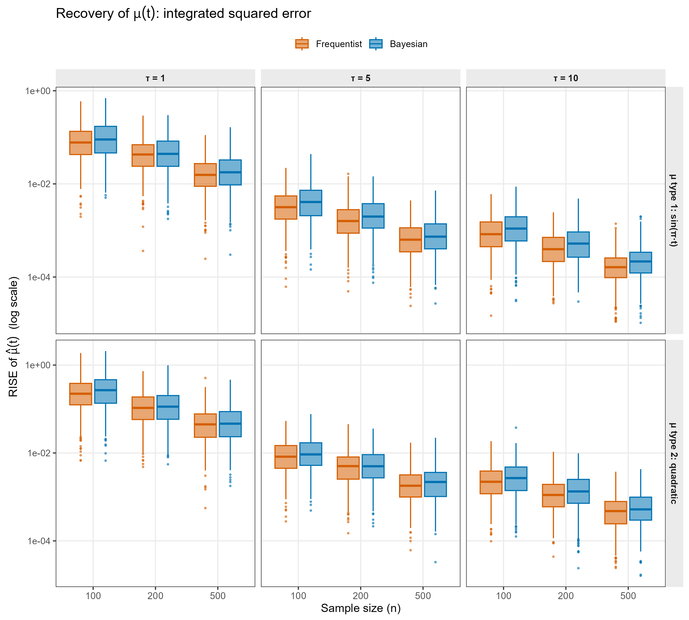
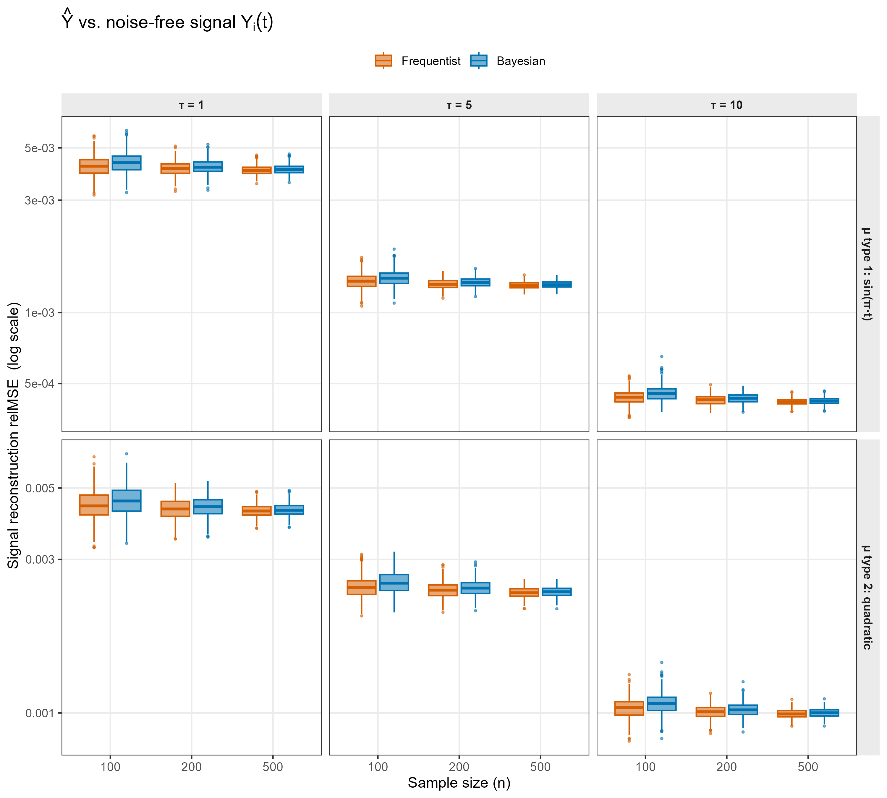

# Bayesian Functional Principal Component Analysis

## Introduction

This vignette provides a detailed guide to the
[`fpca_bayes()`](https://zirenjiang.github.io/refundBayes/reference/fpca_bayes.md)
function in the `refundBayes` package, which fits a Bayesian Functional
Principal Component Analysis (FPCA) model using Stan. Unlike the
regression-style functions in the package (`sofr_bayes`, `fosr_bayes`,
`fcox_bayes`, `fofr_bayes`),
[`fpca_bayes()`](https://zirenjiang.github.io/refundBayes/reference/fpca_bayes.md)
does not relate a functional response to predictors — it instead
decomposes a sample of curves into a smooth population mean function
plus a small number of subject-specific functional principal components,
with full Bayesian uncertainty quantification on every quantity except
the eigenfunctions themselves.

The methodology builds directly on the tutorial by Jiang, Crainiceanu,
and Cui (2025), *Tutorial on Bayesian Functional Regression Using Stan*,
published in *Statistics in Medicine*, and reuses the same
penalized-spline + Stan machinery that powers
[`fosr_bayes()`](https://zirenjiang.github.io/refundBayes/reference/fosr_bayes.md)
for modelling the mean function.

## Install the `refundBayes` Package

The `refundBayes` package can be installed from CRAN:

``` r
install.packages("refundBayes")
```

For the latest version of the `refundBayes` package, users can install
from GitHub:

``` r
library(remotes)
remotes::install_github("https://github.com/ZirenJiang/refundBayes")
```

## Statistical Model

### The FPCA Model

For subject $i = 1,\ldots,n$, let $Y_{i}(t)$ be a functional observation
recorded at $M$ common grid points $t_{1},\ldots,t_{M}$ on a domain
$\mathcal{T}$. The classical FPCA decomposition (Karhunen–Loève
expansion plus measurement error) writes

$$Y_{i}\left( t_{m} \right)\; = \;\mu\left( t_{m} \right)\; + \;\sum\limits_{j = 1}^{J}\xi_{ij}\,\phi_{j}\left( t_{m} \right)\; + \;\epsilon_{i}\left( t_{m} \right),\qquad\epsilon_{i}\left( t_{m} \right)\overset{\text{iid}}{\sim}\mathcal{N}\left( 0,\sigma_{\epsilon}^{2} \right),$$

where:

- $\mu(t)$ is the unknown smooth population mean function,
- $\phi_{1}(t),\ldots,\phi_{J}(t)$ are orthonormal eigenfunctions of the
  covariance operator,
- $\xi_{ij}$ is the subject-specific FPC score on the $j$-th component,
  with $\xi_{ij} \sim \mathcal{N}\left( 0,\lambda_{j}^{2} \right)$,
- $\lambda_{j}^{2}$ is the variance of the $j$-th score (the $j$-th
  eigenvalue of the covariance operator),
- $\sigma_{\epsilon}^{2}$ is the residual measurement-error variance,
  common across $t$ and $i$.

The functional domain $\mathcal{T}$ is **not** restricted to
$\lbrack 0,1\rbrack$; it is whatever interval the columns of the
response matrix represent. The model assumes the same dense grid is
observed for every subject.

### Fixed Eigenfunctions from Frequentist FPCA

The defining feature of
[`fpca_bayes()`](https://zirenjiang.github.io/refundBayes/reference/fpca_bayes.md)
is that the **eigenfunctions $\phi_{j}(t)$ are not sampled**. They are
estimated once, before Stan ever runs, by calling

``` r
init.fpca <- refund::fpca.sc(Y_mat, npc = npc)
```

inside the function. The resulting $M \times J$ matrix
`init.fpca$efunctions` is transposed to $J \times M$ and shipped to Stan
as a **data** matrix called `Phi_mat`. The number of components $J$ is
chosen automatically by
[`fpca.sc()`](https://rdrr.io/pkg/refund/man/fpca.sc.html) based on
percent-variance-explained when `npc = NULL` (the default), or pinned by
the user via the `npc` argument.

There are three reasons for this design choice:

1.  **Identifiability.** Treating the eigenfunctions as parameters
    introduces label-switching, sign-flipping, and orthogonality
    constraints that are notoriously hard to handle in MCMC. Fixing them
    resolves all three issues at once.
2.  **Linearity in Stan.** With $\phi_{j}(t)$ fixed, the model becomes
    linear-Gaussian conditional on the variance components, which Stan
    can sample very efficiently using NUTS / HMC.
3.  **Consistency with the rest of the package.**
    [`fosr_bayes()`](https://zirenjiang.github.io/refundBayes/reference/fosr_bayes.md)
    and
    [`fofr_bayes()`](https://zirenjiang.github.io/refundBayes/reference/fofr_bayes.md)
    use the same fixed-eigenfunction trick to model the residual
    functional process.
    [`fpca_bayes()`](https://zirenjiang.github.io/refundBayes/reference/fpca_bayes.md)
    simply elevates that idea from “nuisance covariance” to “model of
    primary interest”.

The trade-off is that uncertainty in the eigenfunction estimation itself
is **not** propagated into the posterior of the scores or the mean. In
practice, when $n$ is moderately large and the eigenfunctions are
well-separated (eigenvalues of decreasing magnitude with a clear gap),
this is a small price for a fast and stable sampler.

### Mean Function via Penalized Splines

The mean function $\mu(t)$ is represented using a penalized spline
expansion identical to the one used for the response-domain coefficient
functions in
[`fosr_bayes()`](https://zirenjiang.github.io/refundBayes/reference/fosr_bayes.md):

$$\mu(t)\; = \;\sum\limits_{k = 1}^{K}\alpha_{k}\,\psi_{k}(t)\; = \;{\mathbf{α}}^{\top}\mathbf{\Psi}(t),$$

where $\psi_{1}(t),\ldots,\psi_{K}(t)$ are spline basis functions
(B-splines by default, $K = 10$). The basis matrix $\mathbf{\Psi}$ and
its penalty matrix $\mathbf{S}$ are constructed by
[`mgcv::smooth.construct()`](https://rdrr.io/pkg/mgcv/man/smooth.construct.html)
exactly as in
[`fosr_bayes()`](https://zirenjiang.github.io/refundBayes/reference/fosr_bayes.md).
The penalty matrix is then rescaled,

$$\left. \mathbf{S}\;\leftarrow\;\mathbf{S}\,/\,\frac{\parallel \mathbf{S} \parallel_{2}}{\parallel \mathbf{\Psi} \parallel_{\infty}^{2}}, \right.$$

so that the smoothing parameter $\sigma_{\mu}^{2}$ lives on a
numerically sensible scale. This is the same scaling step used
throughout the package.

Smoothness of $\mu(t)$ is induced through the multivariate-normal prior
implied by the quadratic penalty:

$$p\left( {\mathbf{α}} \mid \sigma_{\mu}^{2} \right)\; \propto \;\exp\!\left\{ - \frac{{\mathbf{α}}^{\top}\mathbf{S}\,{\mathbf{α}}}{2\sigma_{\mu}^{2}} \right\}.$$

### Matrix Form Sent to Stan

Let $\mathbf{Y} \in {\mathbb{R}}^{n \times M}$ be the response matrix,
$\mathbf{\Psi} \in {\mathbb{R}}^{K \times M}$ the spline basis (rows =
basis functions, columns = grid points),
$\mathbf{\Phi} \in {\mathbb{R}}^{J \times M}$ the **fixed** FPC
eigenfunctions, ${\mathbf{ξ}} \in {\mathbb{R}}^{n \times J}$ the score
matrix, and $\mathbf{1}_{n} \in {\mathbb{R}}^{n}$ a column of ones. The
Stan model evaluates

$$\mathbf{Y}\; = \;\mathbf{1}_{n}\left( {\mathbf{α}}^{\top}\mathbf{\Psi} \right)\; + \;{\mathbf{ξ}}\,\mathbf{\Phi}\; + \;\mathcal{E},\qquad\mathcal{E}_{im}\overset{\text{iid}}{\sim}\mathcal{N}\left( 0,\sigma_{\epsilon}^{2} \right),$$

implemented as

``` stan
row_vector[M_num] mu_t = alpha' * Psi_mat;
matrix[N_num, M_num] mu = rep_matrix(mu_t, N_num) + xi * Phi_mat;
```

### Full Bayesian Model

The complete Bayesian FPCA model is:

$$\left\{ \begin{array}{l}
{\mathbf{Y}_{i} = \mathbf{\Psi}^{\top}{\mathbf{α}} + \mathbf{\Phi}^{\top}{\mathbf{ξ}}_{i} + {\mathbf{ϵ}}_{i},\quad i = 1,\ldots,n} \\
{\mathbf{\Phi}{\mspace{6mu}\text{fixed}}{\mspace{6mu}\text{(plug-in\ from}\mspace{6mu}}\texttt{𝚛𝚎𝚏𝚞𝚗𝚍::𝚏𝚙𝚌𝚊.𝚜𝚌}\text{)}} \\
{p\left( {\mathbf{α}} \mid \sigma_{\mu}^{2} \right) \propto \exp\!( - {\mathbf{α}}^{\top}\mathbf{S}\,{\mathbf{α}}\,/\, 2\sigma_{\mu}^{2})} \\
{\xi_{ij} \mid \lambda_{j} \sim \mathcal{N}\left( 0,\lambda_{j}^{2} \right),\quad j = 1,\ldots,J} \\
{\sigma_{\mu}^{2},\ \lambda_{j}^{2},\ \sigma_{\epsilon}^{2} \sim {InvGamma}(0.001,0.001)} \\
\end{array} \right.$$

All inverse-Gamma hyper-priors are non-informative, exactly matching the
convention used in `sofr_bayes`, `fosr_bayes`, `fcox_bayes`, and
`fofr_bayes`.

## The `fpca_bayes()` Function

### Usage

``` r
fpca_bayes(
  formula,
  data,
  npc         = NULL,
  runStan     = TRUE,
  niter       = 3000,
  nwarmup     = 1000,
  nchain      = 3,
  ncores      = 1,
  spline_type = "bs",
  spline_df   = 10
)
```

### Arguments

| Argument      | Description                                                                                                                                                                                                                                                                  |
|:--------------|:-----------------------------------------------------------------------------------------------------------------------------------------------------------------------------------------------------------------------------------------------------------------------------|
| `formula`     | A formula of the form `Y_mat ~ 1`. Only the LHS is used — the RHS is parsed but ignored, since FPCA has no predictors.                                                                                                                                                       |
| `data`        | A data frame containing the functional response variable. The response must be stored as an $n \times M$ numeric matrix (one row per subject, one column per grid point), typically wrapped with [`I()`](https://rdrr.io/r/base/AsIs.html) when assigning to the data frame. |
| `npc`         | Number of functional principal components. If `NULL` (default), [`refund::fpca.sc()`](https://rdrr.io/pkg/refund/man/fpca.sc.html) selects $J$ automatically by percent-variance-explained. To pin a specific count, pass an integer.                                        |
| `runStan`     | Logical. Whether to run the Stan program. If `FALSE`, the function only generates the Stan code and data without sampling — useful for inspecting the generated Stan code. Default is `TRUE`.                                                                                |
| `niter`       | Total number of Bayesian posterior sampling iterations (including warmup). Default is `3000`.                                                                                                                                                                                |
| `nwarmup`     | Number of warmup (burn-in) iterations. Default is `1000`.                                                                                                                                                                                                                    |
| `nchain`      | Number of Markov chains for posterior sampling. Default is `3`.                                                                                                                                                                                                              |
| `ncores`      | Number of CPU cores for parallel execution of the chains. Default is `1`.                                                                                                                                                                                                    |
| `spline_type` | Type of spline basis used for the mean function. Default is `"bs"` (B-splines). Any `mgcv` basis name is accepted.                                                                                                                                                           |
| `spline_df`   | Number of degrees of freedom (basis functions) for the mean-function spline. Default is `10`.                                                                                                                                                                                |

### Return Value

The function returns a list of class `"refundBayes"` containing the
following elements:

| Element      | Description                                                                                                                                                                                                            |
|:-------------|:-----------------------------------------------------------------------------------------------------------------------------------------------------------------------------------------------------------------------|
| `stanfit`    | The Stan fit object (class `stanfit`). Use for convergence diagnostics via the `rstan` package.                                                                                                                        |
| `stancode`   | A character string containing the generated Stan model code.                                                                                                                                                           |
| `standata`   | A list containing the data passed to Stan (including `Phi_mat`, `Psi_mat`, `S_mat`, `Y_mat`).                                                                                                                          |
| `mu`         | A $Q \times M$ matrix of posterior samples of the population mean function, evaluated on the input grid. Each row is one posterior draw; each column is one grid point.                                                |
| `efunctions` | An $M \times J$ matrix of the **fixed** eigenfunctions returned by the initial [`refund::fpca.sc()`](https://rdrr.io/pkg/refund/man/fpca.sc.html) call. These are inputs to the Bayesian model, not posterior samples. |
| `scores`     | A $Q \times n \times J$ array of posterior samples of FPC scores $\xi_{ij}$.                                                                                                                                           |
| `evalues`    | A $Q \times J$ matrix of posterior samples of the FPC eigenvalue standard deviations $\lambda_{j}$.                                                                                                                    |
| `sigma`      | A length-$Q$ vector of posterior samples of the residual standard deviation $\sigma_{\epsilon}$.                                                                                                                       |
| `family`     | Always `"fpca"`. Used for class-method dispatch.                                                                                                                                                                       |

When `runStan = FALSE`, every element except `efunctions`, `stancode`,
`standata`, and `family` is filled with `NA`.

### Formula Syntax

Because FPCA has no predictors, the formula syntax for
[`fpca_bayes()`](https://zirenjiang.github.io/refundBayes/reference/fpca_bayes.md)
is intentionally minimal:

``` r
Y_mat ~ 1
```

where `Y_mat` is the **name of the matrix-valued response column** in
`data`. This differs sharply from `sofr_bayes` and `fcox_bayes`, where
`tmat`, `lmat`, and `wmat` encode the Riemann-sum integral against the
functional predictor: there is no integral and no functional predictor
here, so none of those auxiliary matrices are required. The only
requirement is that `data[[Y_mat]]` is a numeric matrix of dimension
$n \times M$ with the same grid across all subjects.

### How the Data Are Auto-Processed

When
[`fpca_bayes()`](https://zirenjiang.github.io/refundBayes/reference/fpca_bayes.md)
is called, the function performs the following steps internally before
invoking Stan:

1.  **Parse the formula** with
    [`brms::brmsformula()`](https://paul-buerkner.github.io/brms/reference/brmsformula.html)
    to extract the response variable name.
2.  **Validate** that `data[[y_var]]` exists and is a matrix.
3.  **Run an initial frequentist FPCA** via
    `refund::fpca.sc(Y_mat, npc = npc)` to obtain the eigenfunction
    basis $\mathbf{\Phi}$ and the number of components $J$.
4.  **Build the mean-function spline basis** $\mathbf{\Psi}$ and penalty
    matrix $\mathbf{S}$ using
    [`mgcv::smooth.construct()`](https://rdrr.io/pkg/mgcv/man/smooth.construct.html)
    on a dummy grid `1:M`. The penalty matrix is rescaled so that the
    smoothing variance is on a numerically sensible scale.
5.  **Assemble the Stan data list** containing $N$, $M$, $J$, $K$,
    $\mathbf{Y}$, $\mathbf{\Phi}$, $\mathbf{\Psi}$, and $\mathbf{S}$.
6.  **Generate the Stan code** for each block (`data`,
    `transformed data`, `parameters`, `transformed parameters`, `model`)
    and concatenate them.
7.  **Run Stan** (or skip if `runStan = FALSE`) and extract posterior
    samples.
8.  **Reconstruct the mean function** at the input grid by computing
    ${\mathbf{α}}^{\top}\mathbf{\Psi}$ for every posterior draw of
    $\mathbf{α}$, so the user receives `mu` already evaluated at the
    observed time points.

The user therefore needs to supply only `Y_mat ~ 1` and a data frame
with a matrix-valued response. No basis construction, no FPCA pre-fit,
and no centering are required from the caller.

## Example: Bayesian FPCA on Simulated Data

We demonstrate
[`fpca_bayes()`](https://zirenjiang.github.io/refundBayes/reference/fpca_bayes.md)
using a small simulated example with a known true mean function, two
true eigenfunctions, and known noise variance, so that posterior
recovery can be checked against the truth.

### Simulate Data

``` r
set.seed(12345)
library(refundBayes)
library(refund)
library(ggplot2)

## Dimensions
n     <- 200
M     <- 50
tgrid <- seq(0, 1, length.out = M)

## True mean function and eigenfunctions
mu_true <- sin(pi * tgrid)
phi1    <- sqrt(2) * sin(2 * pi * tgrid)
phi2    <- sqrt(2) * cos(2 * pi * tgrid)
phi_true <- rbind(phi1, phi2)            # J x M
eigen_true     <- c(2, 0.5)
sigma_eps_true <- 0.3

## Simulate scores and observations
xi_true <- cbind(rnorm(n, sd = sqrt(eigen_true[1])),
                 rnorm(n, sd = sqrt(eigen_true[2])))
Y_mat <- matrix(rep(mu_true, n), nrow = n, byrow = TRUE) +
         xi_true %*% phi_true +
         matrix(rnorm(n * M, sd = sigma_eps_true), nrow = n)

dat <- data.frame(inx = 1:n)
dat$Y_mat <- Y_mat
```

The simulated data set `dat` contains:

- `Y_mat`: an $n \times M$ matrix-valued column of functional
  observations,
- `inx`: a dummy index column (only present so the data frame has the
  right number of rows; it is not used by the model).

### Fit the Bayesian FPCA Model

``` r
fit_fpca <- refundBayes::fpca_bayes(
  formula     = Y_mat ~ 1,
  data        = dat,
  spline_type = "bs",
  spline_df   = 10,
  niter       = 1500,
  nwarmup     = 500,
  nchain      = 1,
  ncores      = 1
)
```

In this call:

- The formula `Y_mat ~ 1` tells the function to treat the column `Y_mat`
  as the functional response and to model only its mean and FPC
  structure.
- The mean function is modelled with 10 B-spline basis functions
  (default settings).
- The number of FPCs is chosen automatically by
  [`refund::fpca.sc()`](https://rdrr.io/pkg/refund/man/fpca.sc.html)
  (typically two for this simulation, matching the truth).
- One chain with 1500 total iterations (500 warmup + 1000 posterior
  samples) is used for demonstration. For production analysis, three
  chains with `niter = 3000`, `nwarmup = 1000` is recommended.

### Visualization

The [`plot()`](https://rdrr.io/r/graphics/plot.default.html) method for
`refundBayes` objects has a dedicated `family = "fpca"` branch that
returns a named list of four `ggplot` objects:

``` r
library(ggplot2)
p <- plot(fit_fpca)        # default prob = 0.95
p$mu                       # posterior mean function with 95% credible band
p$efunctions               # fixed eigenfunctions used as the FPC basis
p$evalues                  # posterior eigenvalue SD with 95% intervals
p$sigma                    # posterior of sigma_eps (histogram)
```

The `prob` argument controls the coverage of the credible bands,
e.g. `plot(fit_fpca, prob = 0.80)` produces 80% bands.

### Extracting Posterior Summaries

Posterior summaries can be computed directly from the returned arrays:

``` r
## Posterior mean of the mean function on the input grid
mu_hat <- apply(fit_fpca$mu, 2, mean)

## Pointwise 95% credible interval for the mean function
mu_lo  <- apply(fit_fpca$mu, 2, function(x) quantile(x, 0.025))
mu_hi  <- apply(fit_fpca$mu, 2, function(x) quantile(x, 0.975))

## Posterior mean of the FPC eigenvalue SDs
lambda_hat <- apply(fit_fpca$evalues, 2, mean)

## Posterior mean of the FPC scores (n x J matrix of point estimates)
scores_hat <- apply(fit_fpca$scores, c(2, 3), mean)

## Posterior mean of the residual SD
sigma_eps_hat <- mean(fit_fpca$sigma)
```

### Reconstructing Fitted Curves ${\widehat{Y}}_{i}(t)$

Because the eigenfunctions are fixed, the Karhunen–Loève reconstruction
is computed simply by combining the posterior mean function with the
posterior score estimates:

``` r
Phi <- fit_fpca$efunctions       # M x J  (fixed)
mu_hat     <- apply(fit_fpca$mu,     2,      mean)   # length M
scores_hat <- apply(fit_fpca$scores, c(2,3), mean)   # n x J

Y_hat <- matrix(rep(mu_hat, n), nrow = n, byrow = TRUE) +
         scores_hat %*% t(Phi)
```

`Y_hat` has dimensions $n \times M$ and is comparable to the observed
`Y_mat` minus measurement error.

### Comparison with Frequentist FPCA

The Bayesian results can be compared with the frequentist FPCA fit
obtained from
[`refund::fpca.sc()`](https://rdrr.io/pkg/refund/man/fpca.sc.html) (or
[`refund::fpca.face()`](https://rdrr.io/pkg/refund/man/fpca.face.html),
which is faster on dense grids):

``` r
library(refund)

fit_freq <- refund::fpca.sc(dat$Y_mat)
## or: fit_freq <- refund::fpca.face(dat$Y_mat)

## Frequentist mean function vs Bayesian posterior mean
plot(tgrid, fit_freq$mu, type = "l", lwd = 2, col = "darkorange",
     ylab = expression(hat(mu)(t)), xlab = "t")
lines(tgrid, mu_hat, col = "blue", lwd = 2)
legend("topright", legend = c("Frequentist", "Bayesian"),
       col = c("darkorange", "blue"), lwd = 2, bty = "n")
```

Because
[`fpca_bayes()`](https://zirenjiang.github.io/refundBayes/reference/fpca_bayes.md)
uses the **same** eigenfunctions as
[`refund::fpca.sc()`](https://rdrr.io/pkg/refund/man/fpca.sc.html) by
construction, the only differences between the two fits come from how
each method estimates the mean function and the FPC scores. The Bayesian
posterior provides full uncertainty quantification on $\mu(t)$,
$\lambda_{j}$, $\xi_{ij}$, and $\sigma_{\epsilon}$ that the frequentist
point estimator does not. The companion files
`Simulation/FPCA_Simulation_V1.R` and `Simulation/FPCA_QuickCheck.Rmd`
provide a more thorough numerical comparison; a summary of that
comparison is reported below.

### Simulation Study: Bayesian vs Frequentist FPCA

To benchmark
[`fpca_bayes()`](https://zirenjiang.github.io/refundBayes/reference/fpca_bayes.md)
against the standard frequentist FPCA fit, we ran a small simulation
study in which both methods are given the **same** eigenfunction basis
so that they can be compared on an apples-to-apples footing. The full
simulation script is shipped as `Simulation/FPCA_Simulation_V1.R`.

#### Simulation Setup

Functional observations were generated from the FPCA model

$$Y_{i}\left( t_{m} \right)\; = \;\mu\left( t_{m} \right)\; + \;\sum\limits_{j = 1}^{4}\xi_{ij}\,\phi_{j}\left( t_{m} \right)\; + \;\epsilon_{i}\left( t_{m} \right),\qquad\epsilon_{i}\left( t_{m} \right)\overset{\text{iid}}{\sim}N\left( 0,0.5^{2} \right),$$

on a uniform grid of $M = 50$ points on $\lbrack 0,1\rbrack$, with
$J = 4$ true Fourier eigenfunctions and true eigenvalues
$(2.5,1.5,0.8,0.4)$. The simulation grid varies three factors:

| Factor                      | Levels                                                                                    |
|:----------------------------|:------------------------------------------------------------------------------------------|
| Sample size $n$             | $100,\; 200,\; 500$                                                                       |
| Mean-function shape         | type 1: $\mu(t) = \tau\,\sin(\pi t)$; type 2: $\mu(t) = \tau\,\{ - 0.5 + (t - 0.5)^{2}\}$ |
| Mean-signal strength $\tau$ | $1,\; 5,\; 10$                                                                            |

Each cell of the $3 \times 2 \times 3 = 18$ design was replicated 500
times, giving 9000 fits per method.

#### Comparator Methods

- **Frequentist baseline** – `refund::fpca.face(Y_mat)`, with mean
  function and FPC scores estimated by penalized least squares.
- **Bayesian model** –
  [`refundBayes::fpca_bayes()`](https://zirenjiang.github.io/refundBayes/reference/fpca_bayes.md)
  (or the equivalent standalone Stan program in
  `Simulation/StanFPCA_Gaussian.stan`), 1 chain, 2000 iterations (1000
  warm-up).

For an apples-to-apples comparison, the same eigenfunction matrix
returned by
[`refund::fpca.face()`](https://rdrr.io/pkg/refund/man/fpca.face.html)
is passed to the Bayesian model as the fixed `Phi_mat`, so the two
methods differ **only** in how they estimate $\mu(t)$ and the FPC scores
$\xi_{ij}$.

#### Performance Metrics

Two relative error measures are reported:

1.  **Recovery of the population mean function** – the relative
    integrated squared error
    $$\text{RISE}(\widehat{\mu})\; = \;\frac{\sum\limits_{m = 1}^{M}\{\widehat{\mu}\left( t_{m} \right) - \mu\left( t_{m} \right)\}^{2}}{\sum\limits_{m = 1}^{M}\mu\left( t_{m} \right)^{2}}.$$

2.  **Recovery of the noise-free signal** – the relative MSE of the
    reconstructed curves
    $$\text{relMSE}(\widehat{Y})\; = \;\frac{\frac{1}{nM}\sum\limits_{i,m}\{{\widehat{Y}}_{i}\left( t_{m} \right) - {\widetilde{Y}}_{i}\left( t_{m} \right)\}^{2}}{\frac{1}{nM}\sum\limits_{i,m}{\widetilde{Y}}_{i}\left( t_{m} \right)^{2}},$$
    where
    ${\widetilde{Y}}_{i}(t) = \mu(t) + \sum_{j}\xi_{ij}\phi_{j}(t)$ is
    the noise-free signal and ${\widehat{Y}}_{i}(t)$ is the
    Karhunen–Loève reconstruction implied by each method.

For the Bayesian fit, both $\widehat{\mu}$ and the FPC scores are taken
to be the posterior median across the MCMC draws.

#### Results

The figures below show boxplots of each metric across the 500 replicates
per cell, on a $\log_{10}$ scale, with rows indexed by mean-function
shape and columns indexed by signal strength $\tau$.

**Recovery of $\mu(t)$ (RISE).** Bayesian and frequentist FPCA recover
the mean function with essentially indistinguishable accuracy; both
error distributions decrease at the expected $\sqrt{n}$ rate, and the
gap between methods is well within the Monte Carlo noise.



Recovery of mu(t)

**Reconstruction of the noise-free signal (relMSE).** The same
conclusion holds for the curve reconstruction: the two methods coincide
up to Monte Carlo error, with the relative MSE driven by the
signal-to-noise ratio (governed by $\tau$) and shrinking with $n$.
Critically, the Bayesian fit attains this accuracy while also providing
posterior credible intervals on $\mu(t)$, $\lambda_{j}$, $\xi_{ij}$, and
$\sigma_{\epsilon}$, which the frequentist plug-in does not.



Signal reconstruction relMSE

In summary, the simulation confirms that switching from
[`refund::fpca.face()`](https://rdrr.io/pkg/refund/man/fpca.face.html)
to
[`fpca_bayes()`](https://zirenjiang.github.io/refundBayes/reference/fpca_bayes.md)
does **not** sacrifice point-estimation accuracy for the mean function
or the curve reconstruction — it simply augments the analysis with a
coherent posterior distribution over every parameter.

### Inspecting the Generated Stan Code

Setting `runStan = FALSE` allows you to inspect or modify the Stan code
before running the model:

``` r
fpca_code_only <- refundBayes::fpca_bayes(
  formula = Y_mat ~ 1,
  data    = dat,
  runStan = FALSE
)
cat(fpca_code_only$stancode)
```

A standalone copy of the same model is also shipped in
`Simulation/StanFPCA_Gaussian.stan`, suitable for
`stan(file = ..., data = ...)` calls.

## References

- Jiang, Z., Crainiceanu, C., and Cui, E. (2025). Tutorial on Bayesian
  Functional Regression Using Stan. *Statistics in Medicine*, 44(20–22),
  e70265.
- Crainiceanu, C. M., Goldsmith, J., Leroux, A., and Cui, E. (2024).
  *Functional Data Analysis with R*. CRC Press.
- Goldsmith, J., Zipunnikov, V., and Schrack, J. (2015). Generalized
  Multilevel Function-on-Scalar Regression and Principal Component
  Analysis. *Biometrics*, 71(2), 344–353.
- Di, C., Crainiceanu, C. M., Caffo, B. S., and Punjabi, N. M. (2009).
  Multilevel functional principal component analysis. *Annals of Applied
  Statistics*, 3(1), 458–488.
- Yao, F., Müller, H. G., and Wang, J. L. (2005). Functional data
  analysis for sparse longitudinal data. *Journal of the American
  Statistical Association*, 100(470), 577–590.
- Wood, S. (2001). mgcv: GAMs and Generalized Ridge Regression for R. *R
  News*, 1(2), 20–25.
- Carpenter, B., Gelman, A., Hoffman, M. D., et al. (2017). Stan: A
  Probabilistic Programming Language. *Journal of Statistical Software*,
  76(1), 1–32.
